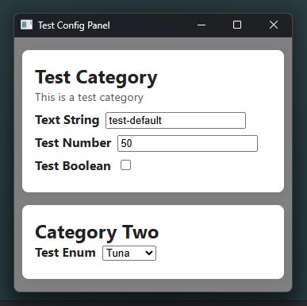

[](https://npmjs.com/package/@shadowmoose/config)
[](https://shadowmoose.github.io/node-config-panel/latest)


# Config Panel
This is my personal configuration GUI, used primarily for rapid development of desktop Node/Bun apps.

This library provides a visual configuration panel, working cross-platform via native webviews or browsers, 
in order to expose real-time configuration options to users in a friendly way.

Because it is web-based, the config panel also supports remote access via web browser.

All configuration values are strongly typed, and validated before being accepted.
The panel can load/save from JSON files and environment variables, and can be extended to support other formats.

[](docs/screenshot.png)

> **Note:**  
> This is an early release, and the API may change in future versions.

## Installation
```npm i @shadowmoose/config```

[Check out the Documentation](https://shadowmoose.github.io/node-config-panel/latest) for more details.

## Example Usage
```typescript
import { ConfigPanel, InputType } from "@shadowmoose/config";

// Define a new configuration panel with strong types.
const config = new ConfigPanel({
    // Define categories.
    first_category: { displayName: 'Test Category', description: 'This is a test category' },
    cat_2: { displayName: 'Category Two' },
}, {
    // Define all config inputs, within each category.
    first_category: {
        text_string: {
            type: InputType.string().max(20).default('test-default'),
            displayName: 'Text String',
            description: 'A simple text string input',
        },
        test_number: {
            type: InputType.number().min(0).max(100).default(50),
            displayName: 'Test Number',
            customParser: (input: any) => {
                if (parseInt(input) % 2 !== 0) throw Error('Number must be even');
                return input;
            }
        },
        test_boolean: {
            type: InputType.boolean().default(false),
            displayName: 'Test Boolean',
            description: 'Check me out.'
        },
    },
    cat_2: {
        test_enum: {
            type: InputType.enum(["Salmon", "Tuna", "Trout"]).default('Tuna'),
            envName: 'FISH_TYPE', // Custom environment variable name.
        },
        complex_string_array: {
            type: z.string().transform(value => value.split(',')).pipe(z.string().trim().min(1).array()),
            default: 'one,two,three', // Example transform from CSV into Array.
            useZodTypeName: 'string', // Render as a string input to the user.
        }
    }
});

// Example: Load existing config from a JSON file and environment variables, then start the interface.
// All values are optional.
await config
    .fromJSON({
        filePath: '.env.json', // Load existing config from a JSON file, if it exists.
    }).fromEnvironment({
        prefix: 'TEST_', // Load existing config from environment variables, with optional prefix.
        envFile: '.env',
    }).startInterface({
        windowOptions: {
            title: 'Test Config Panel',
            width: 350,
            height: 320,
        },
        displayMethod: 'webview', // 'webview' | 'browser' | 'none'
        port: 0, // Use random available port.
        host: '0.0.0.0', // Bind to all interfaces to allow remote access.
        // Optional custom CSS/HTML to apply to the panel. Everything has simple class names to make this easy.
        style: '.category_title { color: blue; } .wrapper_first_category { background: #f0f0f0 !important; }',
        htmlHeader: '<h1 style="text-align: center">Configuration Panel</h1>',
        htmlFooter: '<p style="font-size: small;text-align: center">Generated Panel Demo</p>',
    });

// Example: save updated config to a JSON file.
config.toJSON('.env.json');
// Example: accessing current valid config values live, without waiting.
console.log(config.values);
/* Output: {
    first_category: {
        text_string: string
        test_number: number
        test_boolean: boolean
    }
    cat_2: {
        test_enum: "Salmon" | "Tuna" | "Trout",
        complex_string_array: string[]
    }
} */

// Wait for the panel to be closed, and save the results to a variable.
const results = await config.waitForClose();
console.log('Configured enum value:', results.cat_2.test_enum);
// Output: 'Configured enum value: Tuna'
```

## Event-Driven Updates
All data updates are emitted as events, enabling real-time feedback and dynamic behavior if desired.
Using the above example `config`, you can listen for events like so:
```typescript
config.on('values', console.dir); // Listen for any changes to values.
config.on('change.first_category', console.dir); // Listen for changes to values within a specific category. Strongly typed.
config.on(config.key('test_cat', 'test_number'), console.log); // Listen for changes to a specific value. Strongly typed.
config.on('error', console.error); // Listen for any errors that occur.
config.on('exit', console.error); // Listen for when the panel is closed.
```
