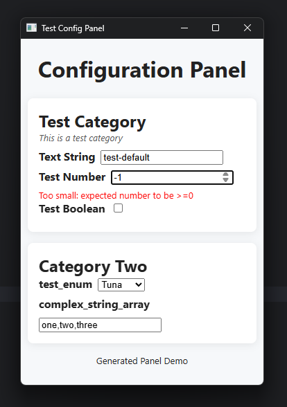

[](https://npmjs.com/package/@shadowmoose/config)
[](https://shadowmoose.github.io/node-config-panel/latest)


# Config Panel
This is my personal configuration library, used primarily for rapid development of desktop Node/Bun apps.
Because most others weren't type-safe enough for my liking.
At last, a config library where ctrl+clicking actually takes you to the definition.

This low-dependency library provides all the usual config parsing
(environment, JSON files, and arguments), and also bundles a web-based configuration panel that 
offers an interactive experience to expose even the most complex configuration options to users in a friendly way.

All configuration values are strongly typed, and validated before being accepted.
This means that even without the GUI, 
the data parsed by this library is more reliable and easier to work with than most other packages.

Because it is web-based, the config panel also offers support for long-running remote configuration.
Basic display capabilities are included, allowing apps to display any data they wish within the UI, 
updating live. Don't like the stock UI? No problem, you can customize it with your own CSS and HTML.

Fetch the latest valid configuration values whenever you want, readily exposed as a simple object,
or listen for changes to specific values as they happen.

The UI even has support for non-configuration elements that nonetheless operate live,
such as buttons and HTML data displays.

[](docs/screenshot.png)

> **Note:**  
> The UI pictured above can be customized to your liking via CSS
> 
## What data does it support?
Anything you can model in Zod, and potentially more.

Out of the box, the library has strong support for:
+ Standard text/number/boolean primitives.
+ Enums, with strongly-typed unions passed all the way through.
+ Arrays, including complex validation on each item.
+ Anything JSON serializable.

The library also offers first-class support for custom Zod schemas and matching HTML elements, 
which can be used to model essentially anything.

## Installation
```npm i @shadowmoose/config```

[Check out the Documentation](https://shadowmoose.github.io/node-config-panel/latest) for more details.

## Example Usage
Here's a long-winded example showcasing many of the supported features.
```typescript
import { ConfigPanel, InputType, Elements } from "@shadowmoose/config";

// Define a new configuration panel with strong types.
const config = new ConfigPanel({
    // Define categories.
    first_category: { displayName: 'Test Category', description: 'This is a test category' },
    cat_2: { displayName: 'Category Two' },
}, {
    // Define all config inputs, within each category.
    first_category: {
        text_string: {
            type: InputType.string().max(20).default('test-default'), // Input types are just Zod schemas.
            displayName: 'Text String',
            description: 'A simple text string input',
        },
        test_number: {
            type: InputType.number().min(0).max(100).refine(value => value % 2 === 0, 'Number must be even'),
            displayName: 'Test Number',
        },
        test_boolean: {
            type: InputType.boolean().default(false),
            displayName: 'Test Boolean',
            description: 'Check me out.'
        },
    },
    cat_2: {
        test_enum: {
            type: InputType.enum(["Salmon", "Tuna", "Trout"]).default('Tuna'),
            envName: 'FISH_TYPE', // Custom environment variable name.
        },
        complex_string_array: {
            type: z.string().transform(value => value.split(',')).pipe(z.string().trim().min(1).array()),
            default: 'one,two,three', // Example transform from CSV into Array.
            useZodTypeName: 'string', // Render as a string input to the user.
        },
        btn_test: Elements.Button({
            text: 'Click Me!', // Example button that temporarily disables itself when clicked.
            onClick: (_path) => {
                // Clicks are also emitted as events, so you could listen for it instead of using this callback.
                console.log('Button clicked!');
                conf.setEnabled('cat_2', 'btn_test', false); // All inputs are strongly typed.
                setTimeout(() => conf.setEnabled('cat_2', 'btn_test', true), 2_000);
            },
        })
    }
});

// Example: Load existing config from a JSON file and environment variables, then start the interface.
// All values are optional.
await config
    .fromJSON({
        filePath: '.env.json', // Load existing config from a JSON file, if it exists.
    }).fromEnvironment({
        prefix: 'TEST_', // Load existing config from environment variables, with optional prefix.
        envFile: '.env',
    }).startInterface({
        title: 'Test Config Panel',
        displayMethod: 'browser', // 'browser' | 'none'
        port: 0, // Use random available port.
        host: '0.0.0.0', // Bind to all interfaces to allow remote access.
        // Optional custom CSS/HTML to apply to the panel. Everything has simple class names to make this easy.
        style: '.category_title { color: blue; } .wrapper_first_category { background: #f0f0f0 !important; }',
        htmlHeader: '<h1 style="text-align: center">Configuration Panel</h1>',
        htmlFooter: '<p style="font-size: small;text-align: center">Generated Panel Demo</p>',
    });

// Example: save updated config to a JSON file.
config.toJSON('.env.json');
// Example: accessing current valid config values live, without waiting.
console.log(config.values);
/* Output: {
    first_category: {
        text_string: string
        test_number: number
        test_boolean: boolean
    }
    cat_2: {
        test_enum: "Salmon" | "Tuna" | "Trout",
        complex_string_array: string[]
    }
} */

// Wait for the panel to be closed, and save the results to a variable.
const results = await config.waitForClose();
console.log('Configured enum value:', results.cat_2.test_enum);
// Output: 'Configured enum value: Tuna'
```

## Event-Driven Updates
All data updates are emitted as events, enabling real-time feedback and dynamic behavior if desired.
Using the above example `config`, you can listen for events like so:
```typescript
config.on('values', console.dir); // Listen for changes to any values.
config.on('change.first_category', console.dir); // Changes to values within a specific category. Strongly typed.
config.on(config.getChangeKey('test_cat', 'test_number'), console.log); // Changes to a specific value. Strongly typed.
config.on('error', console.error); // Listen for any errors that occur.
config.on('exit', console.error); // Listen for when the panel is closed.
```

## Data Visualization
The library also supports sending data to the UI, for display or interaction.
Here's some example code that updates the UI every second with a timer.
```typescript
setInterval(() => {
    config.sendHTML('first_category', `<h3>Current Time: ${new Date().toLocaleTimeString()}</h3>`);
}, 1_000); // Update every second.
```

All value references are preserved and updated as well, so accessing the latest values in the above example without implementing event logic is as simple as:
```
results.cat_2.test_enum
```
